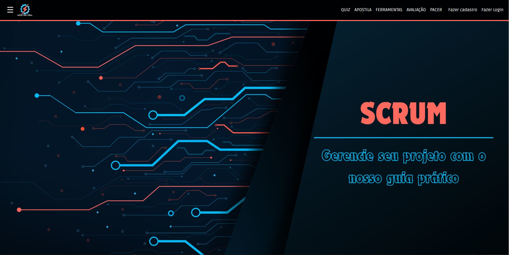

<link rel="stylesheet" type='text/css' href="https://cdn.jsdelivr.net/gh/devicons/devicon@latest/devicon.min.css" />

# Titus Systems - ADS - 1º SEMESTRE/2024

## <a href="https://mestreagil.ddns.net">🔗 Mestre Ágil</a>
<p align="center"><a href="https://mestreagil.ddns.net" source="_blank">

</a></p>

## Índice
1. [Apresentação do Projeto](#apresentação-do-projeto)
2. [Sobre o produto](#📜-sobre-o-produto)
3. [Desenvolvimento Ágil](#⚡-desenvolvimento-ágil)
4. [Ferramentas e Tecnologias Utilizadas](#🖥️-ferramentas-e-tecnologias-utilizadas)
5. [Competências Desenvolvidas](#📊-competencias-desenvolvidas)
    - [Hard Skills](#hard-skills)
    - [Soft Skills](#soft-skills)
6. [Cronograma](#🗓️-cronograma)
7. [Product Backlog](#📋-product-backlog)
8. [Roadmap](#🗺️-roadmap)
9. [Entregas por Sprint](#🔰-entregas-por-sprint)
    - [Sprint 1: Fundamentos](#sprint-1-fundamentos)
    - [Sprint 2: Desenvolvimento das principais funcionalidades](#sprint-2-desenvolvimento-das-principais-funcionalidades)
    - [Sprint 3: Banco de dados e login](#sprint-3-banco-de-dados-e-login)
    - [Sprint 4: Correções e Finalização](#sprint-4-correções-e-finalização)
10. [Instalação](#💻-instalação)
    - [Clonando o repositório](#clonando-o-repositório)
11. [Membros da Equipe](#membros-da-equipe)
    - [SCRUM TEAM](#scrum-team)
12. [Sobre a Empresa](#sobre-a-empresa)

##  Apresentação do projeto

<a href="https://youtu.be/EJ0NXAXMdkQ" source="_blank">
Veja uma exibição no youtube:
<p align="center">

</p></a>

<a href="https://mestreagil.ddns.net" source="_blank">
🔗 Acesse o site e navegue pela plataforma:
<p align="center">

</p></a>


## 📜 Sobre o produto
"Mestre Ágil" é uma plataforma educacional interativa e didática que facilite o aprendizado e a implementação da metodologia SCRUM. A plataforma visa estar completamente imersa nos valores e pilares do SCRUM, priorizando a entrega de conteúdo ao usuário, aliado a ferramentas padronizadas e métodos avaliativos.

## ⚡ Desenvolvimento Ágil
O projeto foi feito seguindo o método Ágil SCRUM, dividindo o trabalho em sprints de 21 dias, com reuniões diáras, revisões e retrospectivas ao final. Essa abordagem permitiu uma gestão eficiente do projeto, com foco na entrega contínua de valor ao cliente. Ao longo das sprints, a equipe adquiriu e aprimorou habilidades técnicas e interpessoais, promovendo a resolução ágil de desafios e a adaptação a novas demandas.

# 🖥️ Ferramentas e Tecnologias Utilizadas

-  **Python**: Programação e desenvolvimento backend
<br><br>
-  **Flask**: Desenvolvimento web, rotas, templates e autenticação de usuários
<br><br>
-  **sqlite**: Manipulação de banco de dados SQL: Criação, leitura, atualização e exclusão de dados (CRUD)
<br><br>
-   **HTML & CSS**: Estruturação e estilização de conteúdo
<br><br>
-  **Bootstrap**: Modificação temas e componentes para atender às necessidades do projeto
<br><br>
-  **Java Script**: Scripts para exibição de conteúdo dinâmico
<br><br>
-  **Amazon Web Service**: Servidor EC2 Ubuntu
<br><br>
-  **NGINX**: Configuração de tráfego https
<br><br>
-  **Git & GitHub**: Controle de versões e colaborações no código
<br><br>
-  **VSCode**: IDE de desenvolvimento
<br><br>
-  **Figma**: Criação de wireframes e design do site
<br><br>
-  **Krita**: Desenvolvimento de designs originais.

## 📊 Competências Desenvolvidas
### Hard Skills
Durante o desenvolvimento deste projeto, a equipe adquiriu e aprimorou as seguintes habilidades técnicas:

- Habilidades analíticas
- Programação em Backend e Frontend
- Conhecimento em ferramentas:
  - Python;
  - Flask;
  - sqlite;
  - HTML, CSS e JavaScript;
  - Ferramenta Bootstrap;
  - Amazon Web Service;
  - NGINX;
  - Git e GitHub;
  - Figma;
- Gestão de projetos:
  - Trabalho com metodologia ágil SCRUM (papéis, seus eventos e artefatos).

### Soft Skills
Além das habilidades técnicas, o projeto proporcionou o desenvolvimento das seguintes habilidades interpessoais:

- Resolução de conflitos;
- Comunicação;
- Trabalho em equipe;
- Adaptabilidade;
- Tomada de decisão;
- Autogerenciamento;
- Pensamento crítico e solução de problemas.


## 🗓️ Cronograma
| Evento       | Data de Início | Data de Término |
|--------------|----------------|-----------------|
| Kick Off     | 12/03          | 12/03           |
| Sprint 1     | 25/03          | 14/04           |
| Sprint 2     | 15/04          | 05/05           |
| Sprint 3     | 06/05          | 26/05           |
| Sprint 4     | 27/05          | 16/06           |

### 📋 Product Backlog


### 🗺️ Roadmap


### 🔰 Entregas por Sprint
1. *Sprint 1. Fundamentos*: 
    - Definição dos requisitos
    - Setup do ambiente de desenvolvimento
    - Estrutura do curso.
2. *Sprint 2 - Desenvolvimento das principais funcionalidades*:
    - Desenvolvimento das funcionalidades que compõem a navegação do curso e a avaliação
    - Inclusão das ferramentas
    - Criação dos critérios de avaliação.
3. *Sprint 3 - Banco de dados e login*:
    - Finalização do conteúdo teórico do curso e da apostila
    - Inclusão dos exemplos práticos
    - Implementação de banco de dados
    - Implementação de login para usuários e administrador
    - Inclusão do feedback dos alunos
    - Páginas de perfil e de administrador
4. *Sprint 4 - Correções e Finalização*:
    - Finalização do conteúdo do site
    - Finalização da estilização do site
    - Responsividade
    - Criação de certificado
    - Correção de bugs

## 💻 Instalação
Para instalar este programa, você vai precisar ter no seu computador no mínimo Python 3.12 e GIT. Quando tiver estes prontos, siga o passo a passo abaixo:

### Clonando o repositório
```bash
git clone https://github.com/Titus-System/1Semestre-ADS.git
cd ./1SEMESTRE-ADS/
pip install -r requirements.txt
cd /app
flask run
```

## Membros da Equipe
### SCRUM TEAM
- *Product Owner*:
    - [Agatha Wei](https://github.com/Agathawei070)
- *SCRUM Master*:
    - [Karina Ribeiro](https://github.com/karinaribeiro2)
- *Dev Team*:
  - [Julia Santiago](https://github.com/juliasantiaggo)
  - [Julia Pereira](https://github.com/juliasoares17)
  - [Marcelo Alves](https://github.com/Tiny-Mushroom)
  - [Pedro Garcia](https://github.com/pedro-fs-garcia)
  - [Wilson Costa](https://github.com/Wilson-Costa1959)

##  Sobre a Empresa
### Missão
Nossa missão é fornecer soluções inovadoras e de alta qualidade que atendam às necessidades dos nossos clientes, garantindo sua satisfação e promovendo um ambiente de trabalho colaborativo e eficiente.

### Visão
Ser uma empresa de referência em inovação e qualidade no desenvolvimento de soluções tecnológicas, reconhecida pela excelência dos nossos produtos e pelo compromisso com nossos clientes e colaboradores.

### Valores
- Qualidade
- Inovação
- Segurança
- O cliente no controle
- Responsabilidade social
- Eficiência

![COMPANY LOGO][logo-titus]

[logo-titus]: https://github.com/Titus-System/1Semestre-ADS/raw/5aaa1b580cbe7d8a66140fdc0de0b304689fa11f/docs/images/logo_empresa.png
[product-backlog]: https://github.com/Titus-System/1Semestre-ADS/raw/5aaa1b580cbe7d8a66140fdc0de0b304689fa11f/docs/images/Backlog_do_Produto.png
[roadmap]: https://github.com/Titus-System/1Semestre-ADS/raw/5aaa1b580cbe7d8a66140fdc0de0b304689fa11f/docs/images/imagem-entregas-por-sprint.png
[product-video]: https://github.com/Titus-System/1Semestre-ADS/raw/5aaa1b580cbe7d8a66140fdc0de0b304689fa11f/docs/images/apresentacao2.mp4
[logo-mestreagil]: https://github.com/Titus-System/1Semestre-ADS/raw/5aaa1b580cbe7d8a66140fdc0de0b304689fa11f/docs/images/logo.png