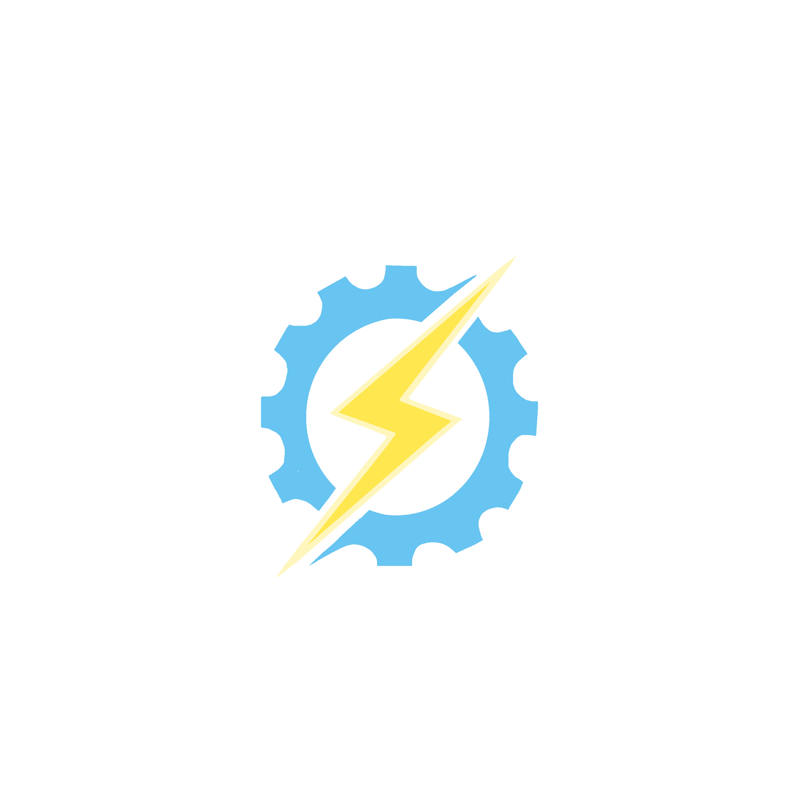
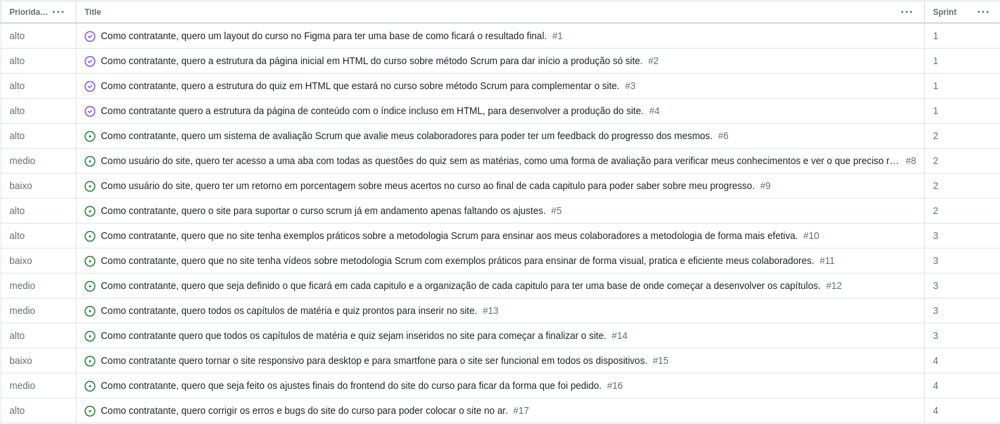
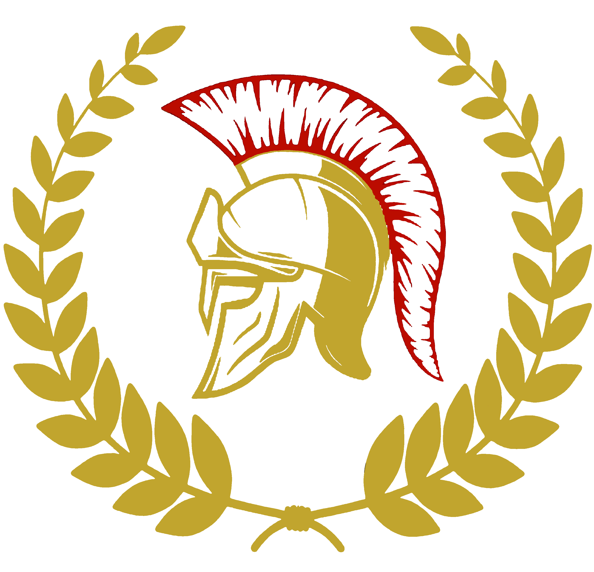

# Titus Systems - 1º Semestre ADS

> 
>
> ## Sobre o Produto
>
> ### Objetivos
>
> - Criar uma plataforma didática para o ensino do metodo **SCRUM**
> - Que possua:
> - - exemplos práticos;
> - - Metodologia padronizada;
> - - Um sistema avaliativo para os usuários;
> - - Linguagem ágil e informal para conformar com a atualidade;
>
> ### Competências
>
> - Utilização de tecnologias de desenvolvimento Front-End:
> - - **HTML**;
> - - **CSS**;
> - - **Bootstrap**;
> - - **Figma**;
>
> - Utilização de tecnologias de desenvolvimento Back-End:
> - - **Python**;
> - - **Flask**;
> - - **JavaScript**;
>
> - Tecnicas de desenvolvimento de projetos com o método **Ágil**.
>
> ### Demonstração do Produto
>
> 
>
> ### Product backlog
>
> 
>
> ## Entregas
>
> ### Sprint 1
>
> ### Sprint 2
>
> ### Sprint 3
>
> ### Sprint 4
>
> ## A Titus Systems
>
>
>
> ### Os Integrantes
>
> Alunos de Analise e Desenvolvimento de Software da FATEC. Primeiro semestre de 2024.
>
> - Product Owner:
> - - Agatha Wey.
> - SCRUM Master:
> - - Karina Ribeiro.
> - Dev Team:
> - - Julia Pereira;
> - - Julia Santiago;
> - - Marcelo Alves;
> - - Pegro Garcia;
> - - Wilson Costa;
>
