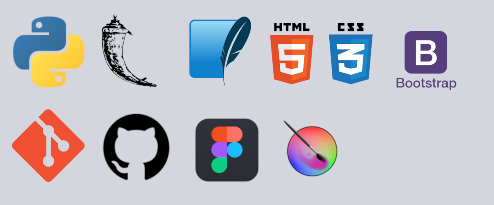

# Titus Systems - ADS - 1º SEMESTRE/2024

## Mestre Ágil
![PRODUCT LOGO][logo-mestreagil]

## Índice
1. [Apresentação do Projeto](#apresentação-do-projeto)
2. [Objetivo do Projeto](#objetivo-do-projeto)
3. [Visão do Produto](#visão-do-produto)
4. [Desenvolvimento Ágil](#desenvolvimento-ágil)
5. [Cronograma](#cronograma)
    - [Cronograma das Sprints](#cronograma-das-sprints)
    - [Product backlog](#product-backlog)
    - [Roadmap](#roadmap)
6. [Tecnologias Utilizadas](#tecnologias-utilizadas)
7. [Competências Desenvolvidas](#competências-desenvolvidas)
    - [Hard Skills](#hard-skills)
    - [Soft Skills](#soft-skills)
8. [Instalação](#instalação)
9. [Membros da Equipe](#membros-da-equipe)
10. [Sobre a Empresa](#sobre-a-empresa)

## Apresentação do projeto
Veja a demonstração do projeto no [youtube](https://youtu.be/quI6hgsdAgw)

## Sobre o produto
Uma plataforma educacional interativa e didática que facilite o aprendizado e a implementação da metodologia SCRUM. A plataforma visa estar completamente imersa nos valores e pilares do SCRUM, priorizando a entrega de conteúdo ao usuário, aliado a ferramentas padronizadas e métodos avaliativos.

## Desenvolvimento Ágil
O projeto foi feito seguindo o método Ágil SCRUM, dividindo o trabalho em sprints de 21 dias, com reuniões diáras, revisões e retrospectivas ao final. Essa abordagem permitiu uma gestão eficiente do projeto, com foco na entrega contínua de valor ao cliente. Ao longo das sprints, a equipe adquiriu e aprimorou habilidades técnicas e interpessoais, promovendo a resolução ágil de desafios e a adaptação a novas demandas.

## Cronograma

| Evento       | Data de Início | Data de Término |
|--------------|----------------|-----------------|
| Kick Off     | 12/03          | 12/03           |
| Sprint 1     | 25/03          | 14/04           |
| Sprint 2     | 15/04          | 05/05           |
| Sprint 3     | 06/05          | 26/05           |
| Sprint 4     | 27/05          | 16/06           |

### Entregas por Sprint
1. **Sprint 1. Fundamentos**: 
    - Definição dos requisitos
    - Setup do ambiente de desenvolvimento
    - Estrutura do curso.
2. **Sprint 2 - Desenvolvimento das principais funcionalidades**:
    - Desenvolvimento das funcionalidades que compõem a navegação do curso e a avaliação
    - Inclusão das ferramentas
    - Criação dos critérios de avaliação.
3. **Sprint 3 - Banco de dados e login**:
    - Finalização do conteúdo teórico do curso e da apostila
    - Inclusão dos exemplos práticos
    - Implementação de banco de dados
    - Implementação de login para usuários e administrador
    - Inclusão do feedback dos alunos
    - Páginas de perfil e de administrador
4. **Sprint 4**: ...

### Roadmap
![ROADMAP][roadmap]

### Product Backlog
![PRODUCT-BACKLOG][product-backlog]

## Ferramentas Utilizadas

- **Python**:
    - Programação: estrutura de dados, manipulação de arquivos e bibliotecas.
    - Desenvolvimento backend: Criacão e manutenção de lógica de servidor, autenticação, autorização e integração com banco de dados.
- **Flask**:
    - Desenvolvimento como aplicação web: Criação de rotas, templates Jinja2, manipulação de requests e formulários.
    - Gerenciameto de login e sessões.
    - Setup de ambientes de desenvolvimento e produção.
- **sqlite**:
    - Manipulação de banco de dados SQL: Criação, leitura, atualização e exclusão de dados (CRUD).
- **HTML & CSS**: 
    - Estruturação de conteúdo com HTML e aplicação de estilo com CSS.
- **Bootstrap**:
    - Utilização de classes Bootstrap para modificar temas e componentes para atender às necessidades do projeto.
- **Git & GitHub**:
    - Controle de versões e colaborações no código.
- **Figma**: Para a criação de wireframes e design do site.
- **Krita**: Desenvolvimento de designs originais.

## Competências Desenvolvidas
### Hard Skills
Durante o desenvolvimento deste projeto, a equipe adquiriu e aprimorou as seguintes habilidades técnicas:

- Habilidades analíticas;
- Programação em Python e 
- Conhecimento em ferramentas:
  - Python
  - Flask
  - sqlite
  - HTML
  - CSS
  - Ferramenta Bootstrap
  - Git e GitHub
  - Figma
- Gestão de projetos;
- Competências técnicas:
  - Trabalho com metodologia ágil SCRUM (papéis, seus eventos e artefatos).

### Soft Skills
Além das habilidades técnicas, o projeto proporcionou o desenvolvimento das seguintes habilidades interpessoais:

- Resolução de conflitos;
- Comunicação;
- Trabalho em equipe;
- Adaptabilidade;
- Tomada de decisão;
- Autogerenciamento;
- Flexibilidade.

## Instalação
Para instalar este programa, você vai precisar ter no seu computador no mínimo Python 3.12 e GIT. Quando tiver estes prontos, siga o passo a passo abaixo:

### Clonando o repositório
```bash
git clone https://github.com/Titus-System/1Semestre-ADS.git
cd ./1SEMESTRE-ADS/
pip install -r requirements.txt
cd /app
flask run
```

## Membros da Equipe
### SCRUM TEAM
- **Product Owner**:
    - [Agatha Wei](https://github.com/Agathawei070)
- **SCRUM Master**:
    - [Karina Ribeiro](https://github.com/karinaribeiro2)
- **Dev Team**:
  - [Julia Santiago](https://github.com/juliasantiaggo)
  - [Julia Pereira](https://github.com/juliasoares17)
  - [Marcelo Alves](https://github.com/Tiny-Mushroom)
  - [Pedro Garcia](https://github.com/pedro-fs-garcia)
  - [Wilson Costa](https://github.com/Wilson-Costa1959)

## Sobre a Empresa
### Missão
Nossa missão é fornecer soluções inovadoras e de alta qualidade que atendam às necessidades dos nossos clientes, garantindo sua satisfação e promovendo um ambiente de trabalho colaborativo e eficiente.

### Visão
Ser uma empresa de referência em inovação e qualidade no desenvolvimento de soluções tecnológicas, reconhecida pela excelência dos nossos produtos e pelo compromisso com nossos clientes e colaboradores.

### Valores
- Qualidade
- Inovação
- Segurança
- O cliente no controle
- Responsabilidade social
- Eficiência

![COMPANY LOGO][logo-titus]

[logo-titus]: https://github.com/Titus-System/1Semestre-ADS/raw/5aaa1b580cbe7d8a66140fdc0de0b304689fa11f/docs/images/logo_empresa.png
[product-backlog]: https://github.com/Titus-System/1Semestre-ADS/raw/5aaa1b580cbe7d8a66140fdc0de0b304689fa11f/docs/images/Backlog_do_Produto.png
[roadmap]: https://github.com/Titus-System/1Semestre-ADS/raw/5aaa1b580cbe7d8a66140fdc0de0b304689fa11f/docs/images/imagem-entregas-por-sprint.png
[product-video]: https://github.com/Titus-System/1Semestre-ADS/raw/5aaa1b580cbe7d8a66140fdc0de0b304689fa11f/docs/images/apresentacao2.mp4
[logo-mestreagil]: https://github.com/Titus-System/1Semestre-ADS/raw/5aaa1b580cbe7d8a66140fdc0de0b304689fa11f/docs/images/logo.png