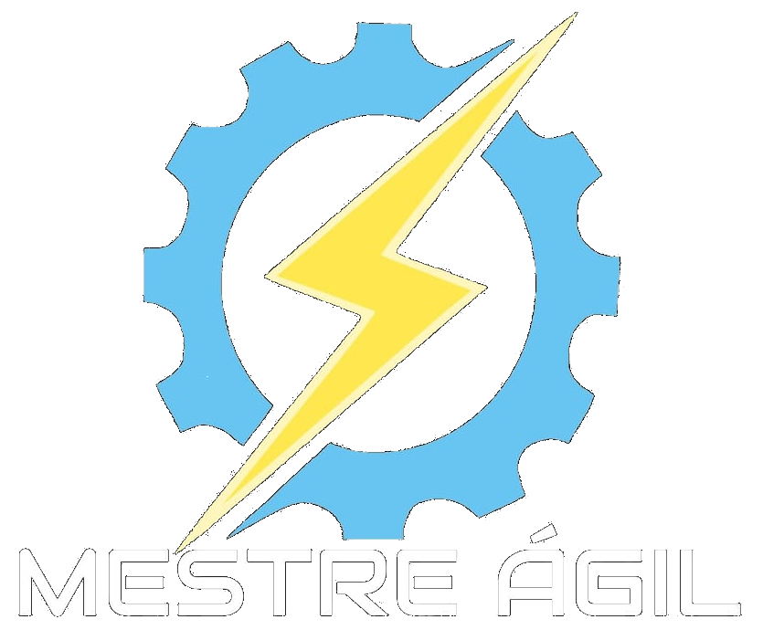

> # 1Semestre-ADS

> # Demontração do Produto:
> (https://github.com/Titus-System/1Semestre-ADS/blob/main/Materiais/slide-apresenta%C3%A7%C3%A3o-1sprint/Apresenta%C3%A7%C3%A3o%20primeira%20sprint%20(1).mp4)

> # Padrao para os Commits
>
> O que escrever no sumário:
> A primeira parte do sumário para os commits deve conter uma palavra chave para o que foi feito:
>
>> - **Codigo {linguagem usada}** em caso de uma adição de codigo.
>> - **Material** em caso de adição de arquivos de texto / slides / documentação / etc.
>> - **Correção {aquivo corrigido}** para casos de alteração de codigo ou material em motivo de corrigir erros.
>> - **Update {arquivo editado}** para casos de adição de codigos ou conteudo em arquivos já criados.
>> - **Organização e limpeza** como argumento único para a alteração de estrutura de diretórios ou embelezamento de codigo.
>
> A segunda parte pode variar de a cordo com o que for considerado informações importantes que devem ser lidas sem abrir o relatorio.
>
>> Coisas como motivo do commit caso não seja claro ou para definir se é um commit funcional  
>> ou se ainda falta alguma outra entrega para que ele funcione corretamente.
>
> Na descrição do produto pode ficar a criterio do contribuidor, mas por favor tenha um resumo de no minimo duas frases para o que foi feito.
>
> Caso haja alteração de varios arquivos, mencione todos os arquivos alterados na descrição. E mantenha tipos de commits differentes em commits separados
> Exemplos:
>
>> Edição de codigo junto com correção de erros devem vir em commits separados, mesmo que sejam no mesmo arquivo.
>> Adição de material e arquivos de imagens devem ser separadas da adição de arquivos de código.
